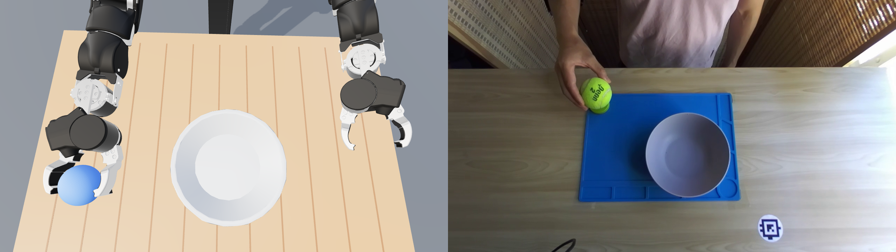

# Project: the same task with a robot and a human hand

## The idea in simple words

We want to create two matched versions of the same simulated task:

1. An OpenArm robot picks up a ball, carries it to a bowl, drops it in, and
   returns home.
2. A human hand picks up the same ball, follows a similar path, drops it into
   the same bowl, and returns home.

The robot version already works. The project is to build the human-hand version
so that the two executions are meaningfully comparable.

Once both versions work, we can run them across many randomized ball and bowl
positions to create a synthetic dataset. Each task configuration can produce a
pair of examples: one performed by the robot and one performed by the human
hand.



_Left: the OpenArm gripper picking up the ball in simulation. Right: a human picking up the ball in a recorded session._

### Recorded human example

The following real six-second clip, extracted from episode 10 of a local
`ball-in-the-bowl-simple` session, shows the human pickup, carry, and release:

<video src="docs/videos/human-ball-bowl.mp4" controls muted playsinline width="720"></video>

[Open or download the recorded human example](docs/videos/human-ball-bowl.mp4)

This recording is a reference for natural human motion, not a trajectory to
copy verbatim. The simulated human hand must still preserve the comparable
OpenArm pose, side-on approach, and task-space trajectory described below.

## Core requirement: the poses must be comparable

> **The main requirement is not merely that both embodiments succeed. At every
> corresponding phase, the human hand pose must be comparable to the robot
> gripper pose.**

Here, “pose” includes both the placement of the hand in space and its grasp
configuration:

- **Position:** the human palm should be near the corresponding robot
  end-effector position relative to the ball or bowl.
- **Orientation:** the palm and wrist should face approximately the same
  direction as the gripper.
- **Approach direction:** both should approach the ball from the side, parallel
  to the tabletop.
- **Grasp state:** an open robot gripper corresponds to an open C-shaped hand;
  a closed gripper corresponds to the thumb and fingers closing around the
  ball.
- **Object relationship:** the ball should occupy a comparable position between
  the gripper jaws or inside the human hand.

The intended correspondence is:

| OpenArm | Human hand |
| --- | --- |
| Gripper center | Center of the palm-side grasp |
| Gripper axis parallel to the table | Wrist and palm oriented parallel to the table |
| Two open opposing jaws | Open C-shaped thumb and fingers |
| Jaws closed around the ball | Thumb and fingers closed around the ball |
| Gripper opens above the bowl | Hand opens above the bowl |

The joint angles cannot be identical because the embodiments have different
kinematics. Comparability is measured in task space: the poses should look like
two embodiment-specific versions of the same action. A human motion that drops
onto the ball from above, turns the palm in a different direction, or uses a
fundamentally different grasp does not satisfy the goal even if it gets the ball
into the bowl.

## What “the same task” means

Both embodiments should receive the same task specification: the same ball,
bowl, desk, gravity, and randomized object positions. Both should then perform
the same sequence:

1. Start from a home pose.
2. Move near the ball without colliding with the desk or bowl.
3. Approach and physically grasp the ball.
4. Lift the ball.
5. Carry it above the bowl.
6. Lower and release it into the bowl.
7. Move away and return home.

The ball must move because it is held through simulated contact. It must not be
teleported, welded to the hand, parented to it, or moved by directly setting the
ball pose.

## What “a similar grasp” means

The robot and human hand have very different joints, so their joint angles
cannot match. Instead, their grasps should have the same physical meaning.

The robot holds the ball between two opposing gripper jaws. The human hand
should mirror that arrangement by making a rounded **C-shaped or cup-shaped
grasp**:

A key part of the symmetry is the approach orientation. The OpenArm gripper
approaches the ball from the side, with its wrist-to-fingertip axis approximately
**parallel to the tabletop**. The human forearm, wrist, and palm should use the
same horizontal approach. The hand should not descend vertically onto the ball
from above.

- the thumb opposes the curved fingers;
- the open side of the C-shaped hand faces the ball horizontally, like the open
  side of the OpenArm gripper;
- the hand surrounds the ball before closing;
- the fingers maintain enough physical contact to lift and carry it; and
- the hand opens above the bowl to release it.

Think of the robot jaws and the human thumb-and-fingers as two different ways
of creating the same opposing contact around the ball. We care about this
functional symmetry, not literal anatomical imitation.

## What “a similar trajectory” means

The robot end effector and the human wrist/palm should follow the same broad
route through the workspace:

```text
home → pre-grasp → grasp → lift → above bowl → release → retreat → home
```

Their paths should visit comparable regions in the same order and approach the
ball and bowl from comparable directions. The human wrist orientation should
also remain functionally aligned with the robot gripper orientation.

The paths do not need to match point for point. The human hand may need extra
clearance, different timing, or a slightly different wrist angle because its
shape and contact behavior differ from the robot gripper. Those embodiment
differences are valuable, provided the task intent remains aligned.

## The synthetic dataset we want

For each randomized task, the desired result is a matched pair:

| Robot episode | Human-hand episode |
| --- | --- |
| Same ball and bowl configuration | Same ball and bowl configuration |
| Gripper pose at each task phase | Comparable wrist, palm, and hand pose |
| Parallel-jaw grasp | Cup-shaped thumb-and-fingers grasp |
| Robot end-effector trajectory | Comparable wrist/palm trajectory |
| Physical lift, carry, and release | Physical lift, carry, and release |
| Successful placement in the bowl | Successful placement in the bowl |

The episodes do not have to be frame-for-frame copies. They should be aligned
by task and by semantic phase so that a dataset consumer can compare how two
different embodiments accomplish the same goal.

A useful dataset should capture the task specification, object poses, robot or
hand state, trajectory, contacts, and outcome. It should contain successful
paired executions across varied ball and bowl positions, along with enough
information to reproduce and understand failures.

## What is already provided

The repository already includes:

- the working OpenArm reference behavior;
- the randomized ball, bowl, desk, and contact-physics parameters;
- a physical 27-DOF right human hand;
- a movable six-DOF human wrist;
- joint limits, collision geometry, and contact groups; and
- shared simulation, control, recording, and visualization utilities.

The missing piece is the human-hand behavior: its grasp pose, wrist trajectory,
finger motion, contact strategy, and release behavior.

The implementation is the `HumanPolicy` class in
[`scenarios/ball_bowl/human_project.py`](scenarios/ball_bowl/human_project.py).
It implements the same `EpisodePolicy` contract as the OpenArm reference
([`openarm_policy.py`](scenarios/ball_bowl/openarm_policy.py)): plan the grasp
and motion, expose the route and parked poses, and execute the phases through
the shared runner, which records, checks and exports both embodiments
identically. The OpenArm implementation is a behavioral reference, not an
algorithm that must be copied. Waypoints, optimization, retargeting, motion
capture, or another approach are all acceptable.

## What success looks like

The project is successful when:

- corresponding human and OpenArm poses remain comparable, including the
  side-on, table-parallel approach and cup-shaped grasp;
- the human trajectory looks natural, within the reasonable limits imposed by
  emulating robot motion, and is fully kinematically feasible: reachable,
  continuous, and within joint limits;
- the hand physically lifts, carries, and releases the ball without unintended
  collisions;
- the behavior works in both fixed and randomized task configurations; and
- human and robot episodes form coherent pairs for the synthetic dataset.

Start with the fixed configuration and make the symmetry easy to see. Then
generalize to randomized scenes without losing the shared task structure.

For environment setup, container commands, diagnostics, and replay tools, see
the root [`README.md`](README.md).
